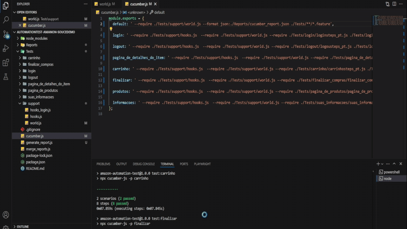
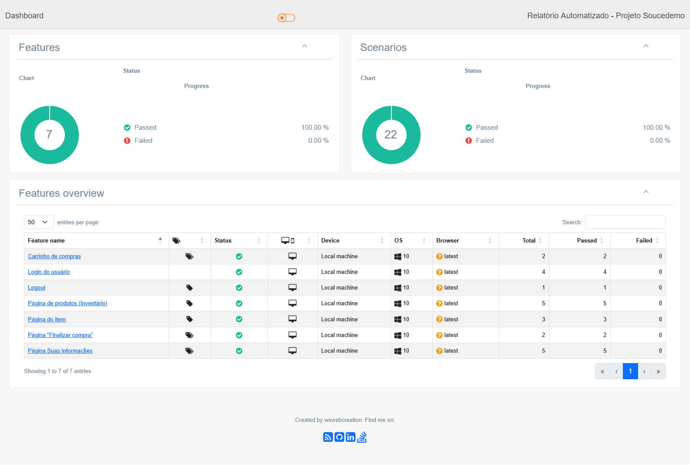

🛒 Projeto de Automação — SauceDemo com Gherkin + Playwright

Este projeto foi desenvolvido para testar técnicas modernas de automação utilizando Gherkin e Playwright, com foco em comunicação acessível e eficiente dentro de uma equipe multidisciplinar.

📍 Objetivo do Projeto:
  ✅ Utilizar Gherkin para escrever testes em linguagem natural, facilitando o entendimento e a colaboração entre pessoas técnicas e não técnicas.
  ✅ Integrar o Playwright como motor de execução, tornando a automação mais robusta e ágil.
  ✅ Estruturar os testes de forma modular, garantindo que mudanças em uma parte do sistema (por exemplo, página de login) não quebrem a automação de outras áreas.

🔍 O que foi testado:
  -Login e Logout.
  -Adição e remoção de produtos no carrinho.
  -Preenchimento de informações de usuário.
  -Finalização de compras
  -Aplicação e validação de filtros de produto

⚠ Nota: Testes de segurança não foram incluídos, pois estavam fora do escopo para este projeto.

🎬 GIF do teste rodando:
 

📊 Resultados dos Testes
Aqui você pode ver o gráfico gerado a partir dos relatórios:

  

💡 Aprendizados
Durante o desenvolvimento deste projeto, eu:

  -Aprimorei meu domínio do Visual Studio Code, entendendo melhor a estrutura de automação de testes.
  -Aprendi a identificar quando a automação deve ser aplicada e quais partes do sistema mais se beneficiam dela.
  -Ganhei experiência prática com repositórios Git e versionamento, especialmente ao recuperar versões anteriores após um crash crítico no projeto.
  -Superei dificuldades para gerar relatórios detalhados e visuais a partir do projeto automatizado, conquistando no final uma solução funcional e apresentável.
  -Foi um caminho desafiador, mas estou extremamente satisfeito com os resultados obtidos!

🚀 Como rodar o projeto:

# Instale as dependências
  -npm install

# Execute todos os testes
  -npm run test:all

# Gere os relatórios
  -npm run merge:reports
  -npm run generate:html

📂 Tecnologias usadas
  -Playwright
  -Cucumber + Gherkin
  -Node.js

  Relatórios HTML (via cucumber-html-reporter)
